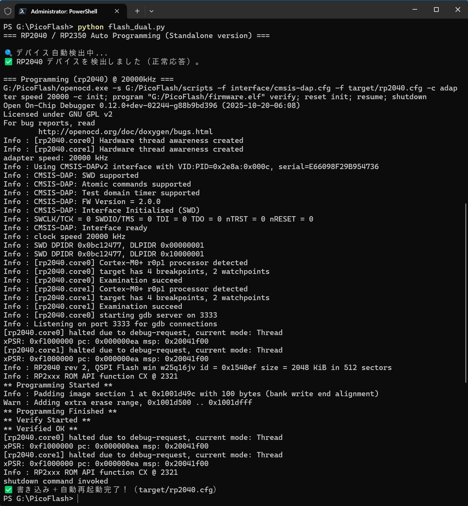

# pico/pico2両方のpico probeで動作する、raspberry pi pico/pico2プログラマ ポータブル版
## 概要
raspberry pi pico/pico2を量産書き込み向けにpico probeでSWD経由でプログラムを書き込むwindows用プログラマです。  
フォルダ内ファイルのみで動作するポータブル版です
## 使い方
ファームウエアは**firmware.elf**というelfファイルを用意します
（VScode＋PlatformIOでpico開発すると、このファイル名になります）
.elfファイル以外は使用しません  
別のファームウエアを書き込みたいときは、このfirmware.elfを上書きしてください  

※Gitに含まれるfirmware.elfは、pico2のLEDblinkのテストプログラムです.適宜上書きしてお使いください  

下のターミナル画面は、USBドライブにPicoFlashという名前でフォルダを作成して、その中に全てのファイル・フォルダをコピーして使用していますが、フォルダ名は何でも良く、ルートでも構いません

flash_dual.pyと同じフォルダにfirmware.elfを置いて、windows PowerShellでフォルダを開き
python flash_dual.py
と打てば、RP2040/RP2350自動判別し書き込み完了＆再起動します  

  

エラーが出る場合
flash_dual.pyの"adapter:speed:"を10000ぐらいに下げてみる  

## 著作権
MITライセンス